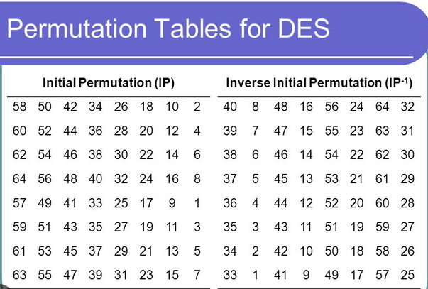

# Cryptography Notes

### Cryptography
Way of talking securely between two persons in the presence of third

- Plain text:: doesn't need a key. human readable.
- Cipher text:: needs some kind of decryption to be readable, usually a key.
- Encryption:: process of encoding a message so that only authorized people can access it.
- Decryption:: process of decoding the message to read it 
- Key:: needed for both enryption and decryption

Thus, encryption/decryption is a function with message and key as parameters.

cipherText = f(message, key)

plainText = f(cipherText, key)


#### Symmetric Crypto Systems = Private Key Crypto Systems
- Uses only one key for both encryption and decryption.

Main disadvantage: private key must be exchanged. For a system with large number of users, it becomes an issue.

### Asymmetric Crypto Systems = Public Key Crypto Systems
- Uses public for encryption (to get cipherText) and private key for decryption(to get plainText)

Main advantage: private keys not to be exchanged, so no need to many keys.


## Symmetric Crypto System Algorithms
- Caesar Cipher
- Vignere Cipher
- One-Time Pad
- Data Encryption Standard (DES)

### Caesar Cipher

It is a symmetric crypto system. It is a substitution cipher i.e. each letter of plain text is shifted by a fixed number of places. Thus, the key is the value with which we shift the letters.

Each letter is assigned it's corresponding interger value between 0 and 25 or the ascii is used. When using the range 0 -25::

```C
E(x) = (x + n) % 26
D(x) = (x - n) % 26
```

Although it is simple to implement. The security is not top notch. As the number of letters are limited and encryption is proportional to the key and letters, it can be cracked with some difficulty. There are two approaches to achieve this:

- Brute force method - consider all the values in the key space and check if the plain text makes sense. Detecting valid english language helps here.
- Frequency analysis method - Frequency distribution is analysed in the cipher text. In english language most frequent letters are E, O, I , T and A.
  - Take the frequency distribution of the cipher text
  - Pick out most frequent number in the cipher text (or 2nd most frequent as most frequent can be space)
  - use the formula:
    - ``` key = most frequent letter - letter E ```

### Vignere Cipher

It is polyalphabetic substitution cipher - all the letters of the plain text are shifted with the fixed number of letters.

It is a method of encrypting alphabetical text by using a seried of interwoven Caesar ciphers based on the letters of a keyword. Thus, private key is a word. The numerical representation of the letters in key define how many characters to shift the actual letter in the plain text.

It is more secure than caesar cipher as the keyspace increases to ```pow(26, size of key)```

```C
Ei(xi) = (xi + ki) % 26
Di(xi) = (xi - ki) % 26
```

Two ways of cracking the vignere cipher::
- Brute force: As in caesar cipher, we triage over two message and key. however, it is way more difficult as the keyspace increased exponentially.
- Kasiski Algorithm: If the size of key can be determined, then frequency analysis can be used to decrypt a given message.
  - Find the size of key. Use repeated substrings and it's factors to achieve this.
    - Minimum size of the substrings to be considered 3. This can easily be done with Suffix trees. However, in this repo, brute force method would be used.
    - It can also be the repeated substrings are accidental, because same letter can be reached with different indexes.
    - We can assume if the repeated substring occurs in the plain text and the distance between corresponding characters is a multiple of the keyword length, then the keyword letters would line up in the same way as occurences.
  - Construct substrings from cipher text which are encrypted by same letters
    - Consider the distances between these substrings and find the factor of the distances. The algorith assumes that the length of the key would be the factor with highest count.
  - Use frequency analysis to find the letter of the key
    - Vignere cipher is same as Caesar cipher, just with the multiple subkeys. Thus, fundamental principle is same that the text is shifted.
    - If the length of the key is N, then we know that every Nth letter in encrypted text correspond to the same subkey.
    - If we then create substring containing Nth letter, there would be N substrings after this operation.
      - Every individual substring is encrypted with the same letter.
    - Apply all possible subkeys on the ciphertext
    - Comparing the two frequency distribution (cipher text and english) shall confirm the match of letters and give the possible subkey for the substring.
    - Now, use brute force with matched subkeys to get an english word which can be possible key.
    - decrypt the cipher text

Thus, with the help of Kasiski algorithm, the keyspace can be reduced significantly. This algorithm is the reason for more secure cryptographic algorithms.

### One-Time Pad

The size of the private key is equal to the size of the text. And the algorithm for encryption follows vignere approach.The use of english letters can be problematic as with frequency analysis and Kasiski algorithm it can be cracked. Hence, one good approach would be to use random numbers. Thus, there is a random number used with length same as size of plain text and the plain text is then shifted with the corresponding number in the key.

Thus, Information leaking can be avoided by using random numbers. This is why, random numbers are important in the symmetric crypto systems.

Algorithm::
- Generate a truely random number with length same as plain text. This number is used for one time only with the message. It shall not be reused for other messages.
- Shift the letters in plain text same as in vignere cipher.

```C
Ei(Xi) = (Xi + OTPi) % 26
Di(Xi) = (Xi - OTPi) % 26
```

Initially, one time pad cipher was used with XOR operation. Addition of two numbers is same as bitwise XOR if there are no carry bits.
- Convert the ascii values of the plain text letters into binary.
- Binary key shall be of the same length
- Perform the XOR operation.

**How to generate the random numbers??**
Random numbers are a sequence of numbers that cannot be reasonably predicted.

- True Random Numbers
  - Mostly obtained through natural phaenomenon e.g. atmospheric noise, radio active decay
  - uniform in distribution
  - values are independent on each other
  - not so efficient to generate (quite expensive to generate these numbers)
- Pseudo Random Numbers
  - Computer generated numbers i.e. it can be deterministic
  - no uniform distribution
  - values are NOT independent of each other
  - can be efficiently generated

PRNG
- As theese can repeat themselves, they can be predictable. Thus making one time pad cipher not fully secure.
- Security of the one time pad relies on the algorithm used to generate pseudo random numbers
- Algorithms::
  - Middle square method
    - Input of the algorithm is a seed.
    - The seed shall be a true random number e.g. measurement of noise, current time in nanoseconds
      - Multiply the seed by itself
      - Get the middle
      - Middle is the next seed
      - e.g. seed = 152; seed * seed = 23104; seed = 310; seed * seed = 96100; seed = 610; seed * seed = 37210; seed = 210 => 9 digit random number: 310610210
    - Issues::
      - If the initial seed is known, the random numbers generated can be predicted
      - If the algorithm reaches previous seed, the further numbers would be repeating itself
        - This is called period -> before the random number starts repeating itself
        - It depends on the seed exclusively
        - e.g. 2 digit seed -> period = 100, 3 digit seed -> period = 1000
      - Hence, period must be as large as possible
  - Mersenne twister
  - linear congruential generators
    - ```X(n+1) = (a * Xn + c) % m```
    - X0 as seed would need to be defined
    - a, c and m define the period

Size of te keyspace is pow(26, size of the message)

Weakness:
- It is hard to generate the random number, however, PRNG can be predictable and can repeat after a certain period
- Key length is known

**Shanon's Secrecy**

Size of the message space = Size of the cipher text space
It means perfect secrecy i.e. if the space for both message and cipher text is same, it is impossible to say with certainity what is the message as with brute force approach, all the possible plain text would be find when trying to decrypt cipher text. How to know, which one is original message?


### Data Encryption Standard (DES)

It is a symmetric key algorithm. Designed by IBM. It is a block cipher i.e. the plain text is processed to cipher text in number of blocks. It is hybrid of substitution and permutation cipher. Thus, frequency analysis cannot be used to tap information leaking.

DES has a so called Feistel structure.
- Split the plain text into 64 bit blocks. These blocks would be input to the DES algorithm and there are going to be 16 rounds in the algorithm.
- Rounds (iterations) occur during the encryption/decryption
  - 16 rounds
    - input for each round is 64bit block
- Every round need different keys (called subkeys)
- Main advantage is that the decryption method operations are same as encryption method.

Thus::
Block size = 64 bits
Key Size = 64 bits (56 relevant bits are used in algorithm)
Number of rounds = 16
Number of keys = 16 (every subkey is 48 bit long)
Cipher text size = 64 bits

Algorithm:
- The message and private key would be converted in binary and divided in blocks of 64 bits
- For each block::
  - Initial permutation would be performed on the message block
  - Permuted choice 1 would be performed on key block
  - subkeys would be created from permuted choice 1 by performing letf circular shift
    - this would be performed for 16 rounds
    - for each round, the number of times circular shift can be different
  - At the end of 16 rounds, 32 bit swap would be performed between two parts of 64 bit transofmed message block
  - inverse permutation would be performed to get final cipher text block




These values are fixed constants in the DES algorithm. The bits in 64 bit block from the message would be placed as per the initial permutation before beginning the round 1. 

